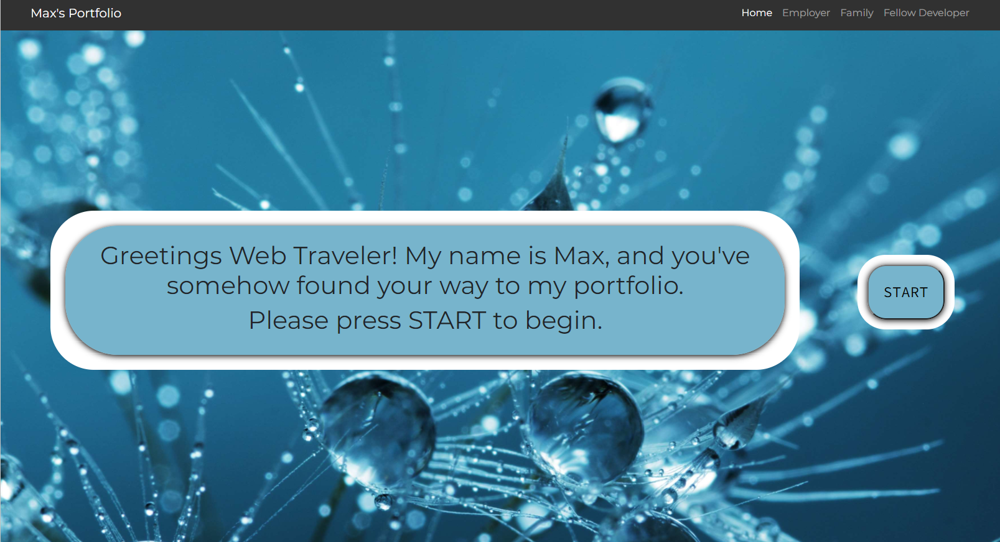

# advanced-portfolio

This is an enhancement on my previous portfolio. It is more interactive and a better demonstration of my skills.
Deployed link on Heroku: https://mdd-portfolio.herokuapp.com/

## Description

My portfolio is a full stack web application that is designed to be like an interactive resume: Enjoyable to use, and concise and to the point. I designed my first portfolio to appeal to the future employers that might come across it, and while that is the most important aspect of a portfolio, I realized I had a much wider audience.

Family and friends were visiting my website, and even some other developers. So, keeping them in mind I tried to design an experience that would cater to my entire audience. The last option in my portfolio is something I'm really excited about. It is an opportunity for me to show off my skills as a software developer, and talent and creativity. It is under construction and coming soon, but I hope everyone that visits can get the chance to come back and try it out when its done.

## Installation and Usage

There is no need for any installation, and the usage is relatively straightforward.

## About the game

L.I.L.I is my first real attempt at creating my own game and designing everything myself from scratch with the tools I'm familiar with, which right now is JavaScript in the browser. Obviously, there are challenges to making a game in the browser that is as robust as people are used to being now a days, but I'm really excited for this because it is coming together in great form. In my research, after I began I found three.js which looks like a great tool for designing games in the browser, but I thought I would give myself a challenge (and avoid having to learn a new thing at the same time as everything else I still have to learn) and use vanilla JavaScript.

The game is essentially a decision making game where L.I.L.I the "AI I designed to service you" is trying to satisfy you, the user, with a game because none of the other options were selected. Essentially I wanted to pay homage to some of my favorite games growing up by recreating them the best I could. I don't want to spoil anything, so I won't tell you what to expect just yet, but I will say so far there are seven different endings to this game, and only a few that could be considered "good". SO come back soon to experience L.I.L.I yourself. I can't wait to see who can find that one "golden route" where everything works out for the best.

## Credits

I will say as you will see, that my goal of the last option of the portfolio was to pay homage to the games that have really impacted me, and the games referrenced were the games I felt I could do enough justice. That being said, a lot of the game is entirely my own creation. As far as the website itself, the entire stack was built by myself, and is currently deployed on Heroku.

## License

MIT

